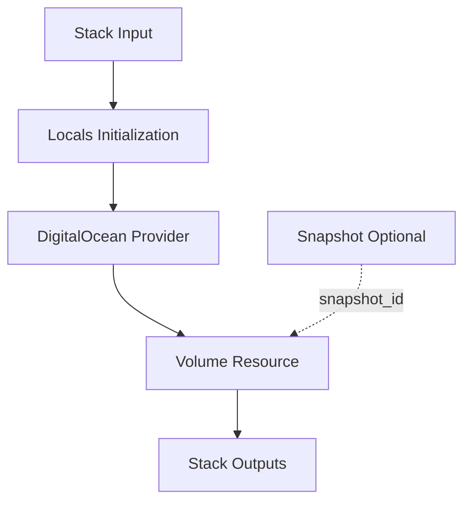

# DigitalOcean Volume - Pulumi Module Architecture

## Module Design Philosophy

This Pulumi module translates Project Planton's protobuf-defined `DigitalOceanVolumeSpec` into DigitalOcean Volume resources. The design follows these principles:

1. **Spec-Driven**: Configuration is read from protobuf messages, not raw Pulumi code
2. **80/20 Coverage**: Implements the 20% of features that 80% of users need
3. **Idempotent**: Multiple runs converge to desired state without side effects
4. **Production-Ready**: Handles filesystem pre-formatting, snapshots, and tagging

## Module Structure

```
module/
├── main.go       # Entry point: orchestrates resource creation
├── locals.go     # Local variables, labels, and computed values
├── volume.go     # Volume resource provisioning
└── outputs.go    # Stack output definitions
```

### File Responsibilities

#### `main.go` - Orchestration

The entry point that coordinates the module workflow:

```go
func Resources(ctx *pulumi.Context, stackInput *StackInput) error {
    // 1. Initialize locals (labels, computed values)
    locals := initializeLocals(ctx, stackInput)
    
    // 2. Create DigitalOcean provider
    digitalOceanProvider := createProvider(ctx, locals)
    
    // 3. Provision volume
    volume := createVolume(ctx, locals, digitalOceanProvider)
    
    // 4. Export outputs
    exports(ctx, volume)
    
    return nil
}
```

**Key Decisions:**
- Provider is created explicitly (not using default provider config)
- Resources are created in dependency order
- Outputs are exported for cross-stack references

#### `locals.go` - Configuration Preprocessing

Prepares data structures and labels:

```go
type Locals struct {
    DigitalOceanProviderConfig *DigitalOceanProviderConfig
    DigitalOceanVolume         *DigitalOceanVolume
    DigitalOceanLabels         map[string]string
}

func initializeLocals(ctx *pulumi.Context, stackInput *StackInput) *Locals {
    // Extract metadata
    // Build standard Planton labels
    // Prepare provider configuration
}
```

**Label Structure:**

Standard Project Planton labels applied to resources:

```go
labels := {
    "planton.cloud/resource":      "true",
    "planton.cloud/resource-kind": "DigitalOceanVolume",
    "planton.cloud/resource-name": "prod-db-data",
    "planton.cloud/resource-id":   "dovol-abc123",
    "planton.cloud/organization":  "my-org",
    "planton.cloud/environment":   "production",
}
```

**Note:** DigitalOcean Volumes support tags (strings), not key-value labels. The module converts labels to tags using `key:value` format.

#### `volume.go` - Core Resource Logic

Provisions the `digitalocean.Volume` resource:

```go
func createVolume(
    ctx *pulumi.Context,
    locals *Locals,
    digitalOceanProvider *digitalocean.Provider,
) (*digitalocean.Volume, error) {
    
    spec := locals.DigitalOceanVolume.Spec
    
    // 1. Determine filesystem type
    // 2. Check if creating from snapshot
    // 3. Build tags from spec + metadata labels
    // 4. Create volume resource
    // 5. Export stack outputs
}
```

**Key Implementation Details:**

1. **Filesystem Type Conversion**:
   ```go
   // Protobuf enum to DigitalOcean API format
   filesystemTypeMap := map[string]string{
       "NONE": "",
       "EXT4": "ext4",
       "XFS":  "xfs",
   }
   ```
   - Protobuf: `NONE` (0), `EXT4` (1), `XFS` (2)
   - DigitalOcean API: `""`, `"ext4"`, `"xfs"`

2. **Snapshot Handling**:
   ```go
   var snapshotId pulumi.StringPtrInput
   if spec.SnapshotId != "" {
       snapshotId = pulumi.String(spec.SnapshotId)
   }
   ```
   - If `snapshot_id` is provided, volume is created from snapshot
   - Volume inherits region and minimum size from snapshot

3. **Tag Aggregation**:
   ```go
   tags := pulumi.StringArray{}
   // Add spec tags
   for _, tag := range spec.Tags {
       tags = append(tags, pulumi.String(tag))
   }
   // Add metadata labels as tags (key:value format)
   for k, v := range locals.DigitalOceanLabels {
       tags = append(tags, pulumi.String(fmt.Sprintf("%s:%s", k, v)))
   }
   ```
   - Combines spec tags + metadata labels
   - Enables cost tracking and organization

4. **Volume Resource Creation**:
   ```go
   volume, err := digitalocean.NewVolume(ctx, "volume", &digitalocean.VolumeArgs{
       Name:                   pulumi.String(spec.VolumeName),
       Description:            pulumi.String(spec.Description),
       Region:                 pulumi.String(spec.Region.String()),
       Size:                   pulumi.Int(int(spec.SizeGib)),
       InitialFilesystemType:  pulumi.String(filesystemType),
       SnapshotId:             snapshotId,
       Tags:                   tags,
   }, pulumi.Provider(digitalOceanProvider))
   ```

#### `outputs.go` - Stack Output Definitions

Exports volume metadata for cross-stack references:

```go
const (
    OpVolumeId = "volume_id"
)

func exports(ctx *pulumi.Context, volume *digitalocean.Volume) {
    ctx.Export(OpVolumeId, volume.ID())
}
```

**Output Usage in Other Stacks:**

```typescript
// Reference volume ID in another Pulumi stack
const volumeStack = new pulumi.StackReference("prod/volume/prod");
const volumeId = volumeStack.getOutput("volume_id");

// Use in volume attachment
const attachment = new digitalocean.VolumeAttachment("attach", {
    volumeId: volumeId,
    dropletId: droplet.id,
});
```

## Resource Dependencies



**Explicit Dependencies:**
- Volume requires DigitalOcean provider

**Optional Dependencies:**
- Volume can depend on snapshot (if `snapshot_id` provided)
- Volume must be in same region as snapshot

## Filesystem Type Strategy

The module supports three filesystem types, each optimized for different use cases:

### XFS (Recommended for Databases)

```yaml
filesystem_type: XFS
```

**Benefits:**
- Superior performance for large files and concurrent I/O
- Efficient online resizing with `xfs_growfs`
- Industry standard for PostgreSQL and MySQL
- Better handling of high-throughput workloads

**Use Cases:**
- PostgreSQL, MySQL, MongoDB databases
- Large file storage (videos, backups)
- High I/O applications

**Mounting:**
```bash
mount -o defaults,nofail,discard,noatime /dev/disk/by-id/scsi-0DO_Volume_name /mnt/data
```

### ext4 (Recommended for General Purpose)

```yaml
filesystem_type: EXT4
```

**Benefits:**
- Mature and stable
- Excellent for many small files
- Lower CPU overhead than XFS for mixed workloads
- Great tool compatibility

**Use Cases:**
- Application data storage
- General-purpose workloads
- Legacy applications

**Mounting:**
```bash
mount -o defaults,nofail,discard /dev/disk/by-id/scsi-0DO_Volume_name /mnt/data
```

### NONE (Manual Formatting)

```yaml
filesystem_type: NONE
```

**Characteristics:**
- Volume is attached as raw, unformatted block device
- Requires manual `mkfs` and mounting
- Advanced use case only

**Use Cases:**
- Custom filesystem requirements (btrfs, ZFS)
- LVM or RAID configurations
- Special partition schemes

**Warning:** Requires complex cloud-init scripts and careful state management to avoid accidental reformatting.

## Snapshot Restore Pattern

Creating a volume from a snapshot is a common disaster recovery and cloning pattern:

```yaml
spec:
  snapshot_id: "123456789"
  size_gib: 600  # Must be >= snapshot size
  region: nyc3   # Must match snapshot region
  filesystem_type: XFS  # Should match original
```

**Implementation:**

```go
if spec.SnapshotId != "" {
    args.SnapshotId = pulumi.String(spec.SnapshotId)
    // Volume inherits filesystem type from snapshot
    // Size can be larger (for growth) but not smaller
}
```

**Critical Constraints:**
1. **Region Lock**: Snapshot and new volume must be in the same region
2. **Size Minimum**: Volume must be ≥ snapshot size
3. **Filesystem Inheritance**: Volume inherits filesystem from snapshot, but specify for clarity

**Snapshot Creation (External to Module):**

```bash
# Create snapshot
doctl compute volume-snapshot create \
  --volume-id vol-abc123 \
  --snapshot-name "nightly-backup-2024-01-15"

# Automated with cron
0 2 * * * doctl compute volume-snapshot create \
  --volume-id $(pulumi stack output volume_id) \
  --snapshot-name "backup-$(date +\%Y-\%m-\%d)"
```

## Volume Resizing Workflow

Resizing a volume is a **two-step process** that IaC tools can only partially automate:

### Step 1: API Resize (Pulumi Handles This)

```yaml
# Update manifest
spec:
  size_gib: 1000  # Increased from 500
```

```bash
pulumi up
# Volume resized at API level
# Block device capacity increased
```

### Step 2: Filesystem Resize (Manual)

```bash
# SSH into Droplet
ssh droplet-ip

# For XFS
sudo xfs_growfs /mnt/mount-point

# For ext4
sudo resize2fs /dev/disk/by-id/scsi-0DO_Volume_name

# Verify
df -h
```

**Why Manual?**
- Filesystem resizing happens inside the OS
- IaC tools operate at infrastructure (API) level
- Cloud-init could automate this, but adds complexity

**Best Practice:** Document the two-step process in your runbook.

## Tag Aggregation Strategy

The module combines tags from multiple sources:

```go
// 1. Spec tags (user-defined)
tags := spec.Tags  // ["env:prod", "service:postgres"]

// 2. Metadata labels (converted to tags)
labels := {
    "organization": "my-org",
    "environment": "production",
}
// Converted to: ["organization:my-org", "environment:production"]

// 3. System tags (automatic)
systemTags := ["managed-by:terraform", "resource:digitalocean-volume"]

// 4. Final tag list
allTags := append(spec.Tags, labelTags, systemTags)
```

**Why This Matters:**
- Enables cost allocation across teams
- Supports automated discovery
- Facilitates compliance reporting
- Provides audit trail

## Error Handling

The module uses Pulumi's automatic error propagation:

```go
volume, err := digitalocean.NewVolume(ctx, "volume", args, ...)
if err != nil {
    return nil, errors.Wrap(err, "failed to create digitalocean volume")
}
```

**Error Scenarios:**
1. **Invalid region** - API error during create
2. **Invalid snapshot ID** - DigitalOcean API returns 404
3. **Size too small for snapshot** - API validation error
4. **Quota exceeded** - Account limit reached

All errors bubble up to Pulumi's stack execution and are reported to the user.

## Idempotency Guarantees

Pulumi ensures idempotency:
1. **Create**: If volume doesn't exist, create it
2. **Update**: If volume exists but config changed, update in place
3. **No-op**: If volume exists with correct config, do nothing
4. **Replace**: If change requires replacement, delete and recreate

**Example:**
```bash
# First run: Creates volume
pulumi up

# Second run: No changes
pulumi up  # "No updates to perform"

# Third run with size change: Updates volume
pulumi up  # "1 to update (size increased)"
```

**Replacement Triggers:**
- Changing `region` (cannot be changed in-place)
- Changing `snapshot_id` (creates different volume)

**In-Place Updates:**
- Changing `size_gib` (can increase, not decrease)
- Changing `tags`
- Changing `description`

## Design Decisions

### 1. Why Separate Filesystem Type Conversion?

```go
filesystemTypeMap := map[string]string{
    "NONE": "",
    "EXT4": "ext4",
    "XFS":  "xfs",
}
```

**Reason:** Protobuf enums are integers. `.String()` converts to name (e.g., "XFS"). DigitalOcean API expects lowercase. Explicit mapping ensures correctness.

### 2. Why Export Only volume_id?

```go
ctx.Export(OpVolumeId, volume.ID())
```

**Reason:** Volume ID is the primary identifier for cross-stack references (e.g., volume attachments). Other fields (size, region) are known from spec.

### 3. Why Convert Labels to Tags?

```go
// Metadata labels
labels := {"app": "postgres", "env": "prod"}

// Converted to tags
tags := ["app:postgres", "env:prod"]
```

**Reason:** DigitalOcean API supports tags (strings), not key-value labels. The `key:value` format preserves structure while working within API constraints.

### 4. Why Pre-Formatted Filesystems by Default?

**Default Recommendation:** Always use `EXT4` or `XFS`, not `NONE`.

**Reason:** Pre-formatting eliminates operational complexity:
- No manual `mkfs` required
- Simpler mount scripts
- No risk of accidentally reformatting existing data
- Consistent across deployments

## Testing Strategy

Module testing is implicit through Pulumi's plan/preview:

```bash
# Dry-run to verify configuration
pulumi preview

# Expected output shows:
# - Resources to create/update/delete
# - Property changes
# - Dependency graph
```

**Manual Testing:**
```bash
# Deploy volume
pulumi up

# Test volume creation
VOLUME_ID=$(pulumi stack output volume_id)
doctl compute volume get $VOLUME_ID

# Verify filesystem type
ssh droplet-ip
lsblk -f | grep DO_Volume
```

## Performance Considerations

**Volume Creation Time:**
- Small volumes (< 100 GiB): ~30-60 seconds
- Large volumes (> 1 TB): ~2-5 minutes
- From snapshot: Adds 1-3 minutes depending on size

**Optimization:**
- Use parallel stack deploys for multiple volumes
- Pre-create volumes before attaching to Droplets

## Limitations and Future Enhancements

### Current Limitations

1. **No Volume Attachment Management** - Module creates volumes but doesn't attach them to Droplets (use separate `digitalocean.VolumeAttachment` resource)
2. **No Snapshot Management** - Snapshots are created externally (via `doctl` or automation)
3. **No Cross-Region Snapshot Copy** - DigitalOcean API limitation (snapshots are region-locked)
4. **No Filesystem Resize Automation** - Step 2 of resize process requires manual OS-level commands

### Planned Enhancements

1. Integrate volume attachment logic
2. Support automated snapshot scheduling
3. Add pre-deployment validation (size, region constraints)
4. Provide cloud-init templates for automated filesystem resizing

## Production Patterns

### Pattern 1: Database Volume with Daily Snapshots

```yaml
spec:
  volume_name: prod-pg-data
  region: sfo3
  size_gib: 500
  filesystem_type: XFS
  tags: ["env:prod", "db:postgres", "backup:daily"]
```

```bash
# Automated daily snapshots (cron)
0 2 * * * doctl compute volume-snapshot create \
  --volume-id $(pulumi stack output volume_id) \
  --snapshot-name "daily-$(date +\%Y\%m\%d)"
```

### Pattern 2: Volume from Snapshot (DR Restore)

```yaml
spec:
  volume_name: restored-pg-data
  snapshot_id: "123456789"
  size_gib: 500
  region: nyc3
  filesystem_type: XFS
```

### Pattern 3: Multi-Environment Volumes

```yaml
# dev.yaml
spec:
  volume_name: dev-data
  size_gib: 10

# staging.yaml
spec:
  volume_name: staging-data
  size_gib: 100

# prod.yaml
spec:
  volume_name: prod-data
  size_gib: 500
```

## Related Documentation

- [README.md](README.md) - Deployment workflow
- [../../docs/README.md](../../docs/README.md) - Research and best practices
- [../../examples.md](../../examples.md) - Usage examples
- [../tf/README.md](../tf/README.md) - Terraform alternative

