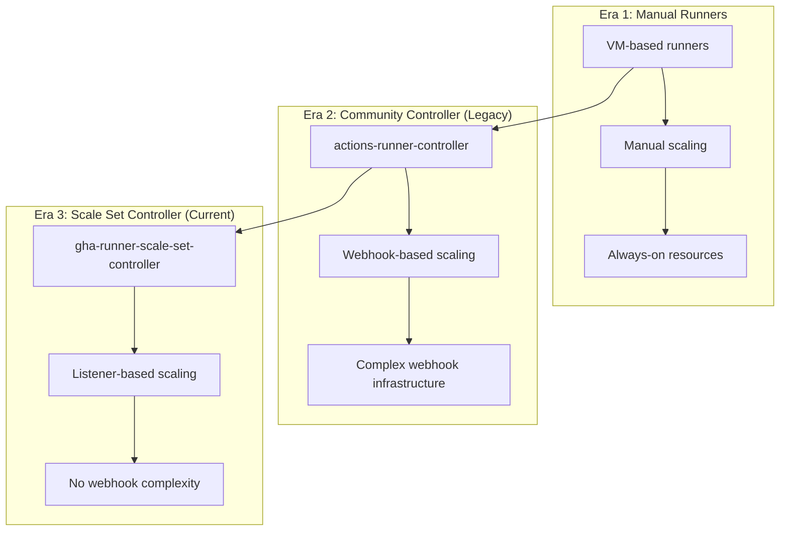
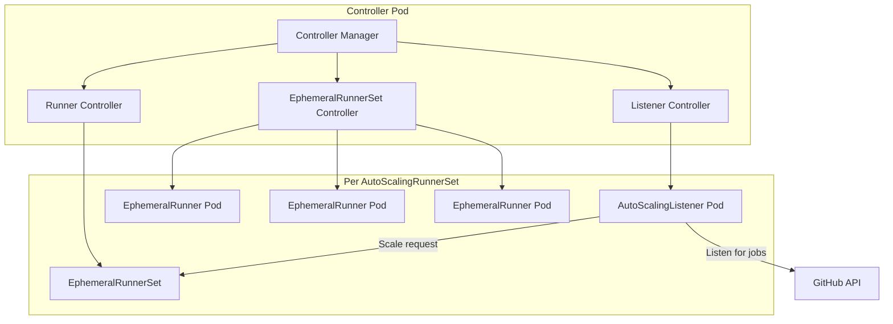
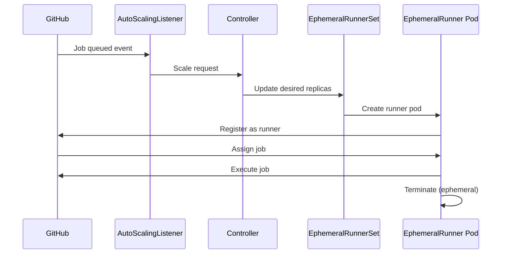

# GitHub Actions Runner Scale Set Controller: Deployment Research

This document provides comprehensive research on deploying the GitHub Actions Runner Scale Set Controller on Kubernetes, exploring deployment methods, architectural decisions, and best practices.

## Introduction

The GitHub Actions Runner Scale Set Controller is the official Kubernetes-native solution for running self-hosted GitHub Actions runners. It replaces the community-maintained actions-runner-controller (legacy mode) with a more scalable and maintainable architecture.

### What Problem Does It Solve?

Self-hosted GitHub Actions runners provide:

1. **Cost Control**: Avoid per-minute charges for GitHub-hosted runners
2. **Custom Environments**: Run workflows in specialized environments
3. **Network Access**: Access internal resources without exposing them
4. **Hardware Customization**: GPU, ARM, or high-memory workloads
5. **Compliance**: Keep CI/CD within your infrastructure perimeter

### Evolution of GitHub Actions Self-Hosted Runners



## Deployment Landscape

### Method 1: Direct Helm Installation

The simplest approach using the official Helm chart:

```bash
helm install arc \
  oci://ghcr.io/actions/actions-runner-controller-charts/gha-runner-scale-set-controller \
  --namespace arc-system \
  --create-namespace
```

**Pros:**
- Officially supported by GitHub
- Regular updates
- Simple installation

**Cons:**
- Manual management outside GitOps
- Version tracking requires external tools

### Method 2: FluxCD/ArgoCD with Helm

GitOps approach using Helm charts:

```yaml
apiVersion: helm.toolkit.fluxcd.io/v2beta1
kind: HelmRelease
metadata:
  name: arc-controller
  namespace: arc-system
spec:
  chart:
    spec:
      chart: gha-runner-scale-set-controller
      sourceRef:
        kind: HelmRepository
        name: actions-runner-controller
  values:
    replicaCount: 1
```

**Pros:**
- GitOps-friendly
- Declarative management
- Easy rollbacks

**Cons:**
- Requires Flux/Argo setup
- Additional abstraction layer

### Method 3: Pulumi/Terraform

Infrastructure-as-code approach:

```go
// Pulumi example
chart, err := helm.NewChart(ctx, "arc-controller", helm.ChartArgs{
    Chart:     pulumi.String("gha-runner-scale-set-controller"),
    Namespace: pulumi.String("arc-system"),
    FetchArgs: helm.FetchArgs{
        Repo: pulumi.String("oci://ghcr.io/actions/actions-runner-controller-charts"),
    },
})
```

**Pros:**
- Full programming language capabilities
- Integration with other infrastructure
- Strong typing and IDE support

**Cons:**
- Requires IaC toolchain
- Learning curve

### Method 4: Project Planton (This Component)

Declarative deployment with validation:

```yaml
apiVersion: kubernetes.project-planton.org/v1
kind: KubernetesGhaRunnerScaleSetController
metadata:
  name: arc-controller
spec:
  namespace:
    value: arc-system
  container:
    resources:
      requests:
        cpu: 100m
        memory: 128Mi
```

**Pros:**
- Schema validation before deployment
- Consistent interface across cloud resources
- Multi-IaC backend support (Pulumi/Terraform)

**Cons:**
- Project Planton dependency

## Architecture Deep Dive

### Controller Components



### Custom Resource Relationships

| CRD | Purpose | Created By |
|-----|---------|------------|
| AutoScalingRunnerSet | User-defined runner configuration | User |
| AutoScalingListener | Listens to GitHub for job events | Controller |
| EphemeralRunnerSet | Manages runner pod lifecycle | Controller |
| EphemeralRunner | Individual runner pod definition | Controller |

### Scaling Workflow



## Project Planton's Approach

### 80/20 Scoping Decision

This component focuses on the **controller deployment only**, which represents the 80/20 of what users need:

**In Scope:**
- Controller deployment and configuration
- Resource allocation
- Logging and metrics
- High availability (replicas)
- Rate limiting configuration
- Update strategy

**Out of Scope (separate components):**
- AutoScalingRunnerSet configuration
- GitHub authentication secrets
- Runner image customization
- Runner-specific RBAC

### Why Controller-Only?

1. **Separation of Concerns**: Controller is cluster-wide; runner sets are per-team/repo
2. **Different Lifecycles**: Controller updates rarely; runner sets change frequently
3. **Simpler Validation**: Controller config is stable; runner config varies widely
4. **Security Boundaries**: Controller doesn't need GitHub credentials

## Configuration Deep Dive

### Replica Count and Leader Election

When `replicaCount > 1`, the controller enables leader election:

```yaml
spec:
  replicaCount: 3  # Enables HA with leader election
```

- Only one replica actively reconciles at a time
- Other replicas are on standby
- Automatic failover if leader pod fails

### Update Strategies

| Strategy | Behavior | Use Case |
|----------|----------|----------|
| `immediate` | Apply changes instantly | Dev/test environments |
| `eventual` | Wait for running jobs | Production workloads |

The `eventual` strategy prevents:
- Runner overprovisioning during upgrades
- Job interruption from listener recreation

### Concurrent Reconciles

Controls how many EphemeralRunner resources are reconciled simultaneously:

```yaml
spec:
  flags:
    runnerMaxConcurrentReconciles: 10
```

**Trade-offs:**
- Higher values = faster scaling
- Higher values = more API server load
- Default (2) is conservative for most clusters

### Rate Limiting

For large clusters with many runner sets:

```yaml
spec:
  flags:
    k8sClientRateLimiterQps: 50
    k8sClientRateLimiterBurst: 100
```

Prevents controller from overwhelming the Kubernetes API server.

## Production Best Practices

### High Availability

```yaml
spec:
  replicaCount: 3
  priorityClassName: system-cluster-critical
  container:
    resources:
      requests:
        cpu: 200m
        memory: 256Mi
      limits:
        cpu: 1000m
        memory: 1Gi
```

### Monitoring

Enable metrics for Prometheus scraping:

```yaml
spec:
  metrics:
    controllerManagerAddr: ":8080"
    listenerAddr: ":8080"
    listenerEndpoint: "/metrics"
```

Create ServiceMonitor for Prometheus Operator:

```yaml
apiVersion: monitoring.coreos.com/v1
kind: ServiceMonitor
metadata:
  name: arc-controller
spec:
  endpoints:
    - port: metrics
  selector:
    matchLabels:
      app.kubernetes.io/name: gha-runner-scale-set-controller
```

### Security Considerations

1. **Network Policies**: Restrict controller to only needed access
2. **RBAC**: Controller creates ClusterRoleBindings; ensure least privilege
3. **Pod Security**: Consider pod security standards
4. **Image Registry**: Mirror images to internal registry for air-gapped environments

### Resource Sizing Guidelines

| Cluster Size | Replicas | CPU Request | Memory Request |
|--------------|----------|-------------|----------------|
| Small (<10 runner sets) | 1 | 100m | 128Mi |
| Medium (10-50 runner sets) | 2 | 200m | 256Mi |
| Large (50+ runner sets) | 3 | 500m | 512Mi |

## Common Issues and Solutions

### Controller Not Starting

**Symptom**: Controller pod in CrashLoopBackOff

**Causes:**
1. Missing CRDs (check `kubectl get crds | grep actions.github.com`)
2. Insufficient RBAC permissions
3. Resource constraints

**Solution:** Ensure Helm chart installed CRDs correctly.

### Runners Not Scaling

**Symptom**: Jobs queued but no runners created

**Causes:**
1. AutoScalingListener not running
2. GitHub authentication failed
3. Rate limiting hit

**Solution:** Check listener pod logs: `kubectl logs -n <namespace> -l actions.github.com/scale-set-name=<name>`

### High API Server Load

**Symptom**: Kubernetes API server throttling

**Causes:**
1. Too many concurrent reconciles
2. Large number of runner sets
3. Frequent scaling events

**Solution:**
```yaml
spec:
  flags:
    runnerMaxConcurrentReconciles: 2
    k8sClientRateLimiterQps: 20
    k8sClientRateLimiterBurst: 30
```

## Comparison with Legacy Controller

| Feature | Scale Set Controller | Legacy (Webhook) |
|---------|---------------------|------------------|
| Scaling Trigger | Long-polling listener | Webhook events |
| Webhook Required | No | Yes |
| Official Support | GitHub-maintained | Community |
| CRD API | actions.github.com/v1alpha1 | actions.summerwind.dev/v1alpha1 |
| Scale to Zero | Built-in | Requires configuration |

## Conclusion

The GitHub Actions Runner Scale Set Controller represents the evolution of self-hosted runner management. By deploying via Project Planton, teams get:

1. **Validated Configuration**: Schema validation catches errors before deployment
2. **Consistent Interface**: Same manifest structure as other cloud resources
3. **Multi-IaC Support**: Choose Pulumi or Terraform as the backend
4. **Production Defaults**: Sensible defaults for resource allocation

The 80/20 approach of focusing on controller deployment keeps this component focused while allowing flexibility for runner set configurations through separate resources.

## References

- [GitHub ARC Documentation](https://docs.github.com/en/actions/hosting-your-own-runners/managing-self-hosted-runners-with-actions-runner-controller/about-actions-runner-controller)
- [ARC GitHub Repository](https://github.com/actions/actions-runner-controller)
- [Helm Chart Values](https://github.com/actions/actions-runner-controller/blob/master/charts/gha-runner-scale-set-controller/values.yaml)
- [Quickstart Guide](https://docs.github.com/en/actions/hosting-your-own-runners/managing-self-hosted-runners-with-actions-runner-controller/quickstart-for-actions-runner-controller)

