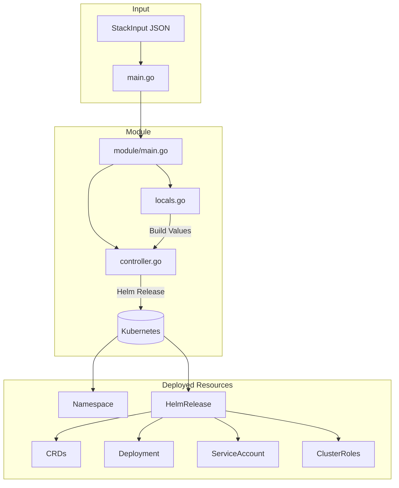
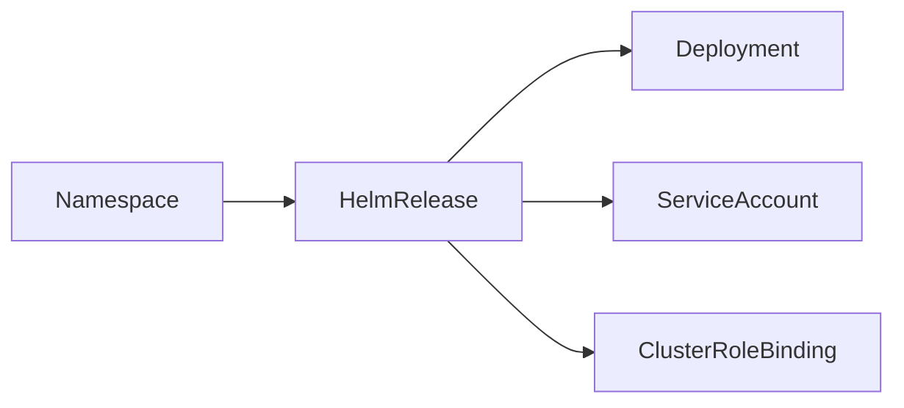

# KubernetesGhaRunnerScaleSetController Pulumi Module Overview

## Architecture



## Data Flow

1. **Input Loading**: `main.go` loads the stack input from environment/file
2. **Locals Initialization**: `locals.go` transforms spec into deployment values
3. **Resource Creation**: `controller.go` deploys Helm release with computed values
4. **Output Export**: Key deployment information exported for downstream use

## Key Design Decisions

### Helm-Based Deployment

We use the official Helm chart rather than raw manifests because:

- **CRD Management**: Helm handles CRD installation and upgrades
- **Version Compatibility**: Chart versions are tested together
- **Configuration**: Helm values provide documented configuration interface
- **Upgrades**: Helm manages rolling updates correctly

### Namespace Handling

The module creates the namespace separately from Helm (`CreateNamespace: false` in Helm) because:

- **Labels**: We can apply custom labels from the resource metadata
- **Control**: Better error handling for existing namespaces
- **Dependencies**: Clear dependency chain for resource ordering

### Value Transformation

The `buildHelmValues` function in `controller.go` transforms the proto spec to Helm values:

```go
spec.Container.Resources.Limits.Cpu → values.resources.limits.cpu
spec.Flags.LogLevel → values.flags.logLevel
```

This keeps the transformation logic centralized and testable.

## Extension Points

### Adding New Configuration

1. Add field to `spec.proto`
2. Regenerate proto stubs
3. Extract value in `locals.go`
4. Map to Helm value in `controller.go`

### Supporting Additional Resources

If the controller needs additional resources (e.g., ServiceMonitor):

1. Create new file (e.g., `monitoring.go`)
2. Add function to create resource
3. Call from `main.go` after Helm release

## Resource Dependencies



The Helm release depends on the namespace (if created), and all other resources are created by Helm with correct internal dependencies.

