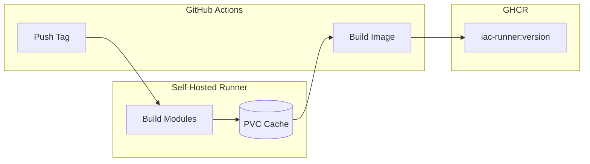

# IaC Runner Base Image

Base Docker image for running Pulumi and OpenTofu/Terraform programs with pre-warmed Go caches.

## Overview

This image dramatically reduces cold start times for Go-based Pulumi programs by including pre-compiled provider SDKs. The caches are built using self-hosted GitHub Actions runners with persistent storage.

## Contents

| Component | Version | Purpose |
|-----------|---------|---------|
| Go | 1.25.0 | Go runtime |
| Pulumi | v3.202.0 | Pulumi CLI |
| OpenTofu | 1.9.1 | Terraform alternative |
| GOMODCACHE | Pre-warmed | Downloaded Go modules |
| GOCACHE | Pre-warmed | Compiled Go packages |

## Usage

```dockerfile
FROM ghcr.io/plantonhq/project-planton/base-images/iac-runner:latest
```

Or with a specific version:

```dockerfile
FROM ghcr.io/plantonhq/project-planton/base-images/iac-runner:v1.0.0
```

## How It Works



1. **Tag pushed** → Triggers workflow
2. **Self-hosted runner** → Builds all Pulumi modules in parallel
3. **PVC cache** → Persists GOMODCACHE and GOCACHE across runs
4. **Docker build** → Copies caches into image
5. **GHCR** → Image published with pre-warmed caches

## Building a New Version

Push a tag to trigger the workflow:

```bash
git tag iac-runner-base-v1.0.0
git push origin iac-runner-base-v1.0.0
```

The workflow will:
- Run on the `project-planton-iac-runner-base-image-builder` self-hosted runner
- Build all Pulumi modules (incrementally, using cached results)
- Package caches into Docker image
- Push to GHCR

## Cache Architecture

| Cache | Path | Purpose |
|-------|------|---------|
| GOMODCACHE | `/var/cache/go-mod` | Downloaded module source code |
| GOCACHE | `/var/cache/go-build` | Compiled `.a` files |

The caches are persisted on a Kubernetes PVC, so subsequent builds only recompile changed modules.

## Files

| File | Purpose |
|------|---------|
| `Dockerfile` | Image definition with cache COPY |
| `Makefile` | Local cleanup commands |
| `.gitignore` | Ignore local cache artifacts |

## Related

- **Workflow**: `.github/workflows/iac-runner-base-image.yml`
- **Self-hosted runner setup**: `planton/tools/ci/github-runners/`
