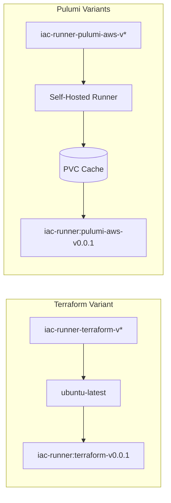

# IaC Runner Base Images

Base Docker images for running infrastructure-as-code programs. Two variants are available:

- **Terraform variant** - Lightweight image with OpenTofu only
- **Pulumi variants** - Per-provider images with pre-warmed Go caches

## Image Repository

All variants use a single repository with descriptive tags:

```
ghcr.io/plantonhq/project-planton/base-images/iac-runner
```

## Variants

### Terraform Variant

Lightweight image for running OpenTofu/Terraform programs. No Go or Pulumi.

| Tag | Contents | Size |
|-----|----------|------|
| `terraform-v0.0.1` | OpenTofu 1.9.1 | ~500MB |

```dockerfile
FROM ghcr.io/plantonhq/project-planton/base-images/iac-runner:terraform-v0.0.1
```

### Pulumi Variants (Per-Provider)

Per-provider images with pre-warmed Go caches for fast cold starts.

| Tag | Provider | Contents |
|-----|----------|----------|
| `pulumi-aws-v0.0.1` | AWS | Go 1.25 + Pulumi + AWS SDK cache |
| `pulumi-gcp-v0.0.1` | GCP | Go 1.25 + Pulumi + GCP SDK cache |
| `pulumi-azure-v0.0.1` | Azure | Go 1.25 + Pulumi + Azure SDK cache |
| `pulumi-kubernetes-v0.0.1` | Kubernetes | Go 1.25 + Pulumi + K8s SDK cache |
| `pulumi-cloudflare-v0.0.1` | Cloudflare | Go 1.25 + Pulumi + Cloudflare SDK cache |
| `pulumi-digitalocean-v0.0.1` | DigitalOcean | Go 1.25 + Pulumi + DO SDK cache |
| `pulumi-atlas-v0.0.1` | MongoDB Atlas | Go 1.25 + Pulumi + Atlas SDK cache |
| `pulumi-auth0-v0.0.1` | Auth0 | Go 1.25 + Pulumi + Auth0 SDK cache |
| `pulumi-civo-v0.0.1` | Civo | Go 1.25 + Pulumi + Civo SDK cache |
| `pulumi-confluent-v0.0.1` | Confluent | Go 1.25 + Pulumi + Confluent SDK cache |
| `pulumi-snowflake-v0.0.1` | Snowflake | Go 1.25 + Pulumi + Snowflake SDK cache |

```dockerfile
FROM ghcr.io/plantonhq/project-planton/base-images/iac-runner:pulumi-aws-v0.0.1
```

## Why Per-Provider Images?

A combined image with all providers is ~15GB. Per-provider images are 1-3GB each:

- Faster image pulls
- Smaller disk footprint
- Only the dependencies you need

## How It Works



**Terraform**: Simple build on GitHub-hosted runners. No caching needed.

**Pulumi**: Uses self-hosted runners with persistent PVC storage. Caches are built incrementally and copied into the Docker image.

## Building New Versions

### Terraform

```bash
git tag iac-runner-terraform-v0.0.1
git push origin iac-runner-terraform-v0.0.1
```

### Pulumi (Per-Provider)

```bash
# Build AWS variant
git tag iac-runner-pulumi-aws-v0.0.1
git push origin iac-runner-pulumi-aws-v0.0.1

# Build GCP variant
git tag iac-runner-pulumi-gcp-v0.0.1
git push origin iac-runner-pulumi-gcp-v0.0.1

# Build Kubernetes variant
git tag iac-runner-pulumi-kubernetes-v0.0.1
git push origin iac-runner-pulumi-kubernetes-v0.0.1
```

## Directory Structure

```
base-images/iac-runner/
├── terraform/
│   └── Dockerfile          # OpenTofu only
├── pulumi/
│   └── Dockerfile          # Go + Pulumi + cache COPY
├── Makefile
└── README.md
```

## Cache Architecture (Pulumi Variants)

| Cache | Path | Purpose |
|-------|------|---------|
| GOMODCACHE | `/var/cache/go-mod` | Downloaded module source code |
| GOCACHE | `/var/cache/go-build` | Compiled `.a` files |

Caches are persisted on a Kubernetes PVC, so subsequent builds only recompile changed modules.

## Related

- **Workflows**:
  - `.github/workflows/iac-runner-terraform.yml`
  - `.github/workflows/iac-runner-pulumi.yml`
- **Self-hosted runner setup**: `planton/tools/ci/github-runners/`
