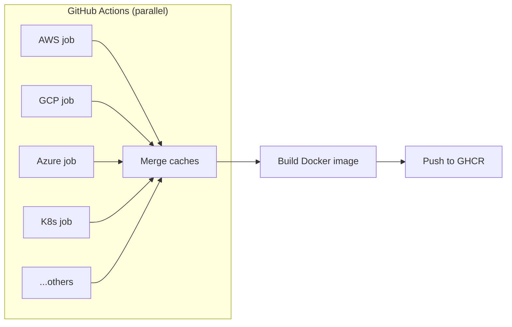

# IaC Runner Base Image

A Docker base image for running Pulumi and OpenTofu/Terraform Go programs with fully pre-warmed Go caches. This dramatically reduces cold start times by pre-building ALL Pulumi modules from project-planton.

## Features

- **Complete cache coverage**: Every Pulumi module is pre-compiled
- **Instant rebuilds**: ~0.5s rebuild time for any cached module
- **Fast first builds**: 15-40s for modules (vs 2-5 min without cache)
- **IaC tools included**: Pulumi CLI, OpenTofu CLI, and Go runtime

## How It Works

The image is built using a GitHub Actions matrix strategy:

1. **Parallel builds**: Each cloud provider's modules are built in parallel
2. **Cache merging**: GOMODCACHE and GOCACHE from all providers are merged
3. **Docker image**: The merged caches are copied into a minimal base image



This approach is much faster than building all modules sequentially in Docker (~10 min vs ~60 min).

## Usage

Use this as your base image:

```dockerfile
FROM ghcr.io/plantonhq/project-planton/base-images/iac-runner:latest

# Your application build steps
COPY . /app
WORKDIR /app
RUN go build -o /usr/local/bin/myapp .

CMD ["/usr/local/bin/myapp"]
```

## Releasing a New Version

Create and push a tag:

```bash
git tag iac-runner-base-v1.0.0
git push origin iac-runner-base-v1.0.0
```

This triggers `.github/workflows/iac-runner-base-image.yml` which:
1. Builds caches for each provider in parallel (matrix jobs)
2. Merges all caches
3. Builds and pushes the Docker image

## Providers Included

| Provider | Description |
|----------|-------------|
| aws | AWS resources (EC2, EKS, Lambda, S3, etc.) |
| gcp | GCP resources (GKE, Cloud Run, GCS, etc.) |
| azure | Azure resources (AKS, Key Vault, etc.) |
| kubernetes | Kubernetes resources and Helm |
| cloudflare | Cloudflare workers, R2, DNS |
| digitalocean | DigitalOcean droplets, K8s |
| atlas | MongoDB Atlas clusters |
| confluent | Confluent Cloud (Kafka) |
| snowflake | Snowflake warehouses |
| auth0 | Auth0 tenants |
| civo | Civo K8s clusters |

## Local Testing

Simulate the matrix build locally:

```bash
cd base-images/iac-runner
./simulate-matrix-build.sh
```

This builds caches for a subset of providers and creates a test Docker image.

## Image Size

The pre-warmed caches result in a larger image (~8-10GB):

| Component | Size |
|-----------|------|
| Base OS + tools | ~300MB |
| GOMODCACHE | ~1-2GB |
| GOCACHE | ~5-7GB |
| **Total** | **~8-10GB** |

**Why the larger image is worth it:**
- Image is pulled once per node and cached
- Every Pulumi module has guaranteed cache hits
- Stateless pods - no need for persistent volumes
- Predictable, consistent performance

## Environment Variables

| Variable | Value | Purpose |
|----------|-------|---------|
| `GOMODCACHE` | `/var/cache/go-mod` | Pre-warmed module cache |
| `GOCACHE` | `/var/cache/go-build` | Pre-warmed build cache |

## Files

| File | Purpose |
|------|---------|
| `Dockerfile` | Standalone build (clones repo, builds all modules) |
| `Dockerfile.merged` | Used by GitHub Actions (copies pre-built caches) |
| `simulate-matrix-build.sh` | Local testing script |

## Versioning

This base image uses independent versioning with the `iac-runner-base-` prefix:

- `ghcr.io/plantonhq/project-planton/base-images/iac-runner:v1.0.0`
- `ghcr.io/plantonhq/project-planton/base-images/iac-runner:latest`

Bump the version when:
- Adding new cloud providers
- Updating Pulumi SDK versions
- Updating Go version
