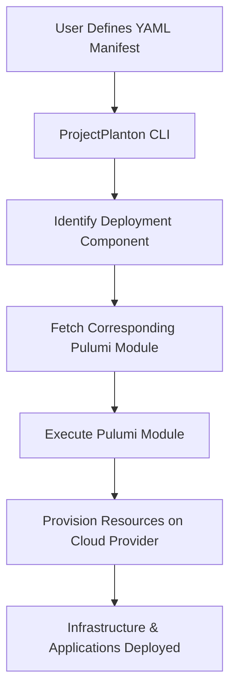

import Image from 'next/image';

    <Image src="/images/logo/logo-full.png" alt="ProjectPlanton logo" width={600} height={400} />

**Effortlessly deploy complex infrastructure across any cloud provider using simple YAML manifests and powerful
automation.**

## TL;DR

ProjectPlanton is an open-source framework that simplifies the deployment of multi-cloud environments with
Kubernetes-like declarative configuration. It enables you to:

- **Define Configuration**: Create Kubernetes-like manifests based
on [ProjectPlanton APIs](apis/project/planton/provider), using simple, consistent APIs written
in [protobuf](https://protobuf.dev/) and published on the [Buf Schema Registry](https://buf.build/product/bsr) to
manage resources across various cloud providers. Essentially, Kubernetes manifests for multi-cloud deployments.

- **Deploy Infrastructure**: Utilize
pre-written [Pulumi modules](https://project-planton.org/pulumi-modules) that take
your YAML configuration manifests as input and handle the complex infrastructure provisioning. Avoid the complexity of
learning intricate deployments with the `project-planton` CLI. The
CLI reads your manifest and determines the appropriate [Pulumi module](https://project-planton.org/pulumi-modules) for
deployment.

export function FAQBox({ title, children }) {
    return (
        

            

                <strong className="text-lg">{title}</strong>
            

            
{children}

        

    )
}

## FAQ

<FAQBox title="What is ProjectPlanton?">
    ProjectPlanton is an open-source framework that brings the declarative design principles of the Kubernetes
    Resource Model (KRM) to multi-cloud environments. It allows developers to define and deploy infrastructure across
    multiple cloud providers using familiar Kubernetes-like manifests and a simple CLI tool.
</FAQBox>

<FAQBox title="Do I need to know Pulumi to use ProjectPlanton?">
    No, you don't need prior knowledge of Pulumi to use ProjectPlanton. The `project-planton` CLI handles the
    interaction with Pulumi modules behind the scenes. However, understanding Pulumi can enhance your ability to customize
    and extend the modules if needed.
</FAQBox>

<FAQBox title="Which cloud providers are supported?">
    ProjectPlanton aims to support all major cloud providers, including AWS, Azure, and Google Cloud Platform.
    Support for additional providers can be added through community contributions.
</FAQBox>

<FAQBox title="How does ProjectPlanton differ from Kubernetes?">
    While ProjectPlanton is inspired by the Kubernetes Resource Model, it does not require a Kubernetes cluster to
    operate. It focuses on multi-cloud deployments using a similar declarative approach but leverages Pulumi modules instead
    of Kubernetes controllers.
</FAQBox>

<FAQBox title="Can I contribute my own Pulumi modules?">
    Yes, contributions are welcome! You can create and share your own Pulumi modules for different deployment
    components.
</FAQBox>
