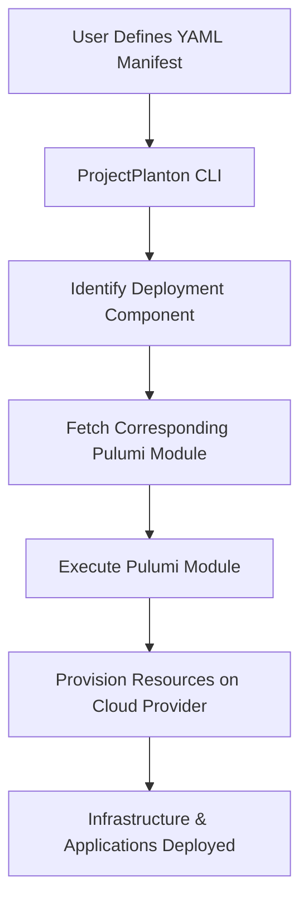

import Image from 'next/image';

<div style={{display: 'flex', justifyContent: 'center', alignItems: 'center', marginBottom: '20px'}}>
    <Image src="/images/logo/logo-full.png" alt="ProjectPlanton logo" width={600} height={400}/>
</div>

**Effortlessly deploy complex infrastructure across any cloud provider using simple YAML manifests and powerful
automation.**

## TL;DR

ProjectPlanton is an open-source framework that simplifies the deployment of multi-cloud environments with
Kubernetes-like declarative configuration. It enables you to:

- **Define Configuration**: Create Kubernetes-like manifests based
on [ProjectPlanton APIs](apis/project/planton/provider), using simple, consistent APIs written
in [protobuf](https://protobuf.dev/) and published on the [Buf Schema Registry](https://buf.build/product/bsr) to
manage resources across various cloud providers. Essentially, Kubernetes manifests for multi-cloud deployments.

- **Deploy Infrastructure**: Utilize
pre-written [Pulumi modules](https://project-planton.org/pulumi-modules) that take
your YAML configuration manifests as input and handle the complex infrastructure provisioning. Avoid the complexity of
learning intricate deployments with the `project-planton` CLI. The
CLI reads your manifest and determines the appropriate [Pulumi module](https://project-planton.org/pulumi-modules) for
deployment.




export function FAQBox({title, children}) {
    return (
        <details
            open
            className="last-of-type:mb-0 rounded-lg bg-neutral-50 dark:bg-neutral-800 p-2 mt-4"
        >
            <summary>
                <strong className="text-lg">{title}</strong>
            </summary>
            <div className="p-2">{children}</div>
        </details>
    )
}


## 3 Steps to Get Started

import { Steps } from 'nextra/components'

<Steps>
    ### Install CLI

    ```shell
    brew install project-planton/tap/project-planton
    ```

    ### Define Configuration

    Define your infrastructure in a simple YAML file for any of the
    available [Deployment Components](https://github.com/project-planton/project-planton/tree/main/apis/project/planton/provider)
    using familiar Kubernetes-like resources. Here is the example
    for [Redis On Kubernetes](https://github.com/project-planton/project-planton/tree/main/apis/project/planton/provider/kubernetes/workloads/rediskubernetes/v1)
    deployment component.

    You can create similar manifests
    for [AWS VPC](https://github.com/project-planton/project-planton/tree/main/apis/project/planton/provider/aws/awsvpcv1), [GKE Cluster](https://github.com/project-planton/project-planton/tree/main/apis/project/planton/provider/gcp/gkecluster/v1), [Kafka on Kubernetes](https://github.com/project-planton/project-planton/tree/main/apis/project/planton/provider/kubernetes/kafkakubernetes/v1)
    or [Kafka On ConfluentCloud](https://github.com/project-planton/project-planton/tree/main/apis/project/planton/provider/confluent/kafkaconfluent/v1)
    and [many more](https://github.com/project-planton/project-planton/tree/main/apis/project/planton/provider).

```yaml
apiVersion: kubernetes.project-planton.org/v1
kind: RedisKubernetes
metadata:
  name: payments
  id: payments-namespace
spec:
  container:
    replicas: 1
    resources:
      limits:
        cpu: 50m
        memory: 2Gi
      requests:
        cpu: 50m
        memory: 100Mi
    isPersistenceEnabled: true
    diskSize: 1Gi
```

    ### Deploy

    The above manifest is the input
    for [redis-kubernetes-pulumi-module](https://github.com/project-planton/redis-kubernetes-pulumi-module). Running the
    following command will read the manifest and set it up as input for the pulumi module.

    ```bash
    project-planton pulumi up --manifest redis.yaml
    ```

    

</Steps>

## How It Works

ProjectPlanton bridges the gap between Kubernetes' declarative resource model and multi-cloud deployments by leveraging
Pulumi modules and a simple CLI tool. Here's an overview of how the system operates:

1. **Declarative Manifests**: Users define their desired infrastructure or application configurations in YAML manifests,
following the familiar structure of Kubernetes resources with `apiVersion`, `kind`, `metadata`, `spec`, and `status`.

2. **Protocol Buffers Definitions**: These manifests correspond to API resources defined in Protocol Buffers (protobuf).
The APIs are published to the Buf Schema Registry (BSR), providing accessible documentation and on-demand SDK
generation in multiple languages.

3. **Field Validation**: Validations are embedded within the protobuf definitions using Protovalidate and Common
Expression Language (CEL). This ensures that the configurations adhere to the expected formats and constraints before
deployment.

4. **CLI Execution**: When the user runs the `project-planton` CLI command, the tool performs the following actions:
    - **Module Retrieval**: It identifies the appropriate Pulumi module repository for the specified deployment
component (e.g., a Kubernetes cluster, database service, etc.).
    - **Pulumi Module Execution**: It clones the Pulumi module and passes the manifest and any additional configuration
to it.
    - **State Management**: Users manage the Pulumi state backend, ensuring that state is preserved across deployments.
    - **Provisioning**: The Pulumi module uses the provided configurations to interact with the target cloud providers'
APIs, provisioning the resources as declared.

5. **Desired State Realization**: Pulumi modules act similarly to Kubernetes controllers but are triggered manually by
the user. They reconcile the declared state in the manifests with the actual state in the cloud environment, ensuring
that the infrastructure matches the desired specifications.

6. **Status Reporting**: After deployment, the `status` field in the manifest can be updated to reflect the current
state of the resources, providing feedback to the user.

## Advantages

- **Consistency Across Clouds**: By abstracting cloud-specific details, developers can deploy resources to any supported
cloud provider using the same declarative approach.
- **Modularity and Reusability**: Pulumi modules are versioned and maintained in separate repositories, promoting reuse
and ease of updates.
- **Transparency and Control**: Unlike automated controllers, users have explicit control over when deployments occur,
allowing for better planning and coordination.

## Compare

| Tool                                                                                | Key Features                                                          | ProjectPlanton Advantages                                                                              |
|-------------------------------------------------------------------------------------|-----------------------------------------------------------------------|--------------------------------------------------------------------------------------------------------|
| [**Crossplane**](https://www.crossplane.io/)                                        | Requires Kubernetes Cluster                                           | No Kubernetes dependency: reduces complexity and resources required                                    |
|                                                                                     | Controller-based reconciliation adds operational overhead             | On-demand execution: more control over when and how changes are applied                                |
|                                                                                     | Multi-cloud support but tightly coupled with Kubernetes               | Simplified architecture: no need for continuously running controllers                                  |
| [**GCP Config Connector**](https://cloud.google.com/config-connector/docs/overview) | GCP-specific, manages Google Cloud resources                          | Multi-cloud support: works across various cloud providers, not limited to GCP                          |
|                                                                                     | Requires Kubernetes Cluster                                           | No Kubernetes requirement: operates independently, simplifying deployment and management               |
| [**SST**](https://sst.dev/)                                                         | AWS-only, focuses on serverless apps                                  | Cloud-agnostic: supports multiple cloud providers for flexibility                                      |
|                                                                                     | Opinionated framework: may not fit all use cases                      | Language flexibility: YAML manifests and Pulumi modules can be written in various languages            |
|                                                                                     | TypeScript only: infrastructure defined in TypeScript                 | Declarative approach: familiar to developers used to Kubernetes Resource Model (KRM)                   |
| [**Cloud Posse**](https://github.com/cloudposse)                                    | AWS-specific Terraform modules                                        | Declarative YAML configuration: promotes readability and ease of use                                   |
|                                                                                     | Terraform-based: uses HCL, steeper learning curve                     | Protocol Buffers and validations: uses Protobuf definitions with Protovalidate and CEL for reliability |
|                                                                                     | Variable-based configuration: can become complex in large deployments | Multi-cloud support: enables deployments across various cloud environments                             |

## FAQ

<FAQBox title="What is ProjectPlanton?">
    ProjectPlanton is an open-source framework that brings the declarative design principles of the Kubernetes
    Resource Model (KRM) to multi-cloud environments. It allows developers to define and deploy infrastructure across
    multiple cloud providers using familiar Kubernetes-like manifests and a simple CLI tool.
</FAQBox>

<FAQBox title="Do I need to know Pulumi to use ProjectPlanton?">
    No, you don't need prior knowledge of Pulumi to use ProjectPlanton. The `project-planton` CLI handles the
    interaction with Pulumi modules behind the scenes. However, understanding Pulumi can enhance your ability to
    customize
    and extend the modules if needed.
</FAQBox>

<FAQBox title="Which cloud providers are supported?">
    ProjectPlanton aims to support all major cloud providers, including AWS, Azure, and Google Cloud Platform.
    Support for additional providers can be added through community contributions.
</FAQBox>

<FAQBox title="How does ProjectPlanton differ from Kubernetes?">
    While ProjectPlanton is inspired by the Kubernetes Resource Model, it does not require a Kubernetes cluster to
    operate. It focuses on multi-cloud deployments using a similar declarative approach but leverages Pulumi modules
    instead
    of Kubernetes controllers.
</FAQBox>

<FAQBox title="Can I customize default Pulumi modules?">
    Yes! You can fork the any of the default pulumi modules since they are all public repositories on github and
    customize it to your needs. The `project-planton` cli lets you to specify the location of your customized pulumi
    module as a git repository or as a local directory.
</FAQBox>

<FAQBox title="Can I create my own Pulumi modules?">
    Yes! You can create and use your own Pulumi modules for different deployment components.
</FAQBox>
