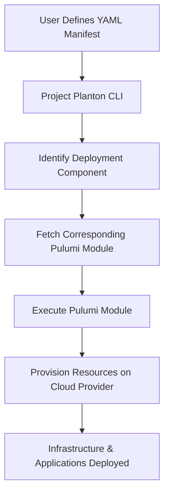

**Get Started in 3 Easy Steps:**

1. **Install the CLI Tool**

```bash
brew install plantoncloud/tap/project-planton
   ```

2. **Create a YAML Manifest**

Define your infrastructure in a simple YAML file for any of the
available [Deployment Components](https://github.com/plantoncloud/project-planton/tree/main/apis/project/planton/provider)
using familiar Kubernetes-like resources. Here is the example
for [Redis On Kubernetes](https://github.com/plantoncloud/project-planton/tree/main/apis/project/planton/provider/kubernetes/rediskubernetes/v1)
deployment component.

You can create similar manifests
for [AWS VPC](https://github.com/plantoncloud/project-planton/tree/main/apis/project/planton/provider/aws/awsvpcv1), [GKE Cluster](https://github.com/plantoncloud/project-planton/tree/main/apis/project/planton/provider/gcp/gkecluster/v1), [Kafka on Kubernetes](https://github.com/plantoncloud/project-planton/tree/main/apis/project/planton/provider/kubernetes/kafkakubernetes/v1)
or [Kafka On ConfluentCloud](https://github.com/plantoncloud/project-planton/tree/main/apis/project/planton/provider/confluent/kafkaconfluent/v1)
and [many more](https://github.com/plantoncloud/project-planton/tree/main/apis/project/planton/provider).

```yaml
apiVersion: kubernetes.project.planton/v1
kind: RedisKubernetes
metadata:
  name: payments
  id: payments-namespace
spec:
  container:
    replicas: 1
    resources:
      limits:
        cpu: 50m
        memory: 2Gi
      requests:
        cpu: 50m
        memory: 100Mi
    isPersistenceEnabled: true
    diskSize: 1Gi
```

3. **Deploy Your Infrastructure**

The above manifest is the input
for [redis-kubernetes-pulumi-module](https://github.com/plantoncloud/redis-kubernetes-pulumi-module). Running the
following command will read the manifest and set it up as input for the pulumi module.

   ```bash
   project-planton pulumi up --manifest redis.yaml
   ```


## How It Works

Project Planton bridges the gap between Kubernetes' declarative resource model and multi-cloud deployments by leveraging
Pulumi modules and a simple CLI tool. Here's an overview of how the system operates:

1. **Declarative Manifests**: Users define their desired infrastructure or application configurations in YAML manifests,
following the familiar structure of Kubernetes resources with `apiVersion`, `kind`, `metadata`, `spec`, and `status`.

2. **Protocol Buffers Definitions**: These manifests correspond to API resources defined in Protocol Buffers (protobuf).
The APIs are published to the Buf Schema Registry (BSR), providing accessible documentation and on-demand SDK
generation in multiple languages.

3. **Field Validation**: Validations are embedded within the protobuf definitions using Protovalidate and Common
Expression Language (CEL). This ensures that the configurations adhere to the expected formats and constraints before
deployment.

4. **CLI Execution**: When the user runs the `project-planton` CLI command, the tool performs the following actions:
 - **Module Retrieval**: It identifies the appropriate Pulumi module repository for the specified deployment
component (e.g., a Kubernetes cluster, database service, etc.).
 - **Pulumi Module Execution**: It clones the Pulumi module and passes the manifest and any additional configuration
to it.
 - **State Management**: Users manage the Pulumi state backend, ensuring that state is preserved across deployments.
 - **Provisioning**: The Pulumi module uses the provided configurations to interact with the target cloud providers'
APIs, provisioning the resources as declared.

5. **Desired State Realization**: Pulumi modules act similarly to Kubernetes controllers but are triggered manually by
the user. They reconcile the declared state in the manifests with the actual state in the cloud environment, ensuring
that the infrastructure matches the desired specifications.

6. **Status Reporting**: After deployment, the `status` field in the manifest can be updated to reflect the current
state of the resources, providing feedback to the user.



## Advantages of This Approach

- **Consistency Across Clouds**: By abstracting cloud-specific details, developers can deploy resources to any supported
cloud provider using the same declarative approach.
- **Modularity and Reusability**: Pulumi modules are versioned and maintained in separate repositories, promoting reuse
and ease of updates.
- **Transparency and Control**: Unlike automated controllers, users have explicit control over when deployments occur,
allowing for better planning and coordination.
