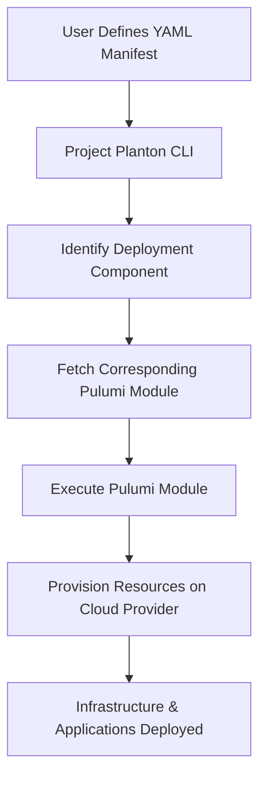

**Effortlessly deploy complex infrastructure across any cloud provider using simple YAML manifests and powerful
automation.**

## TL;DR

ProjectPlanton is an open-source framework that simplifies the deployment of multi-cloud environments with
Kubernetes-like declarative configuration. It enables you to:

- **Define Configuration**: Create Kubernetes-like manifests based
on [ProjectPlanton APIs](apis/project/planton/provider), using simple, consistent APIs written
in [protobuf](https://protobuf.dev/) and published on the [Buf Schema Registry](https://buf.build/product/bsr) to
manage resources across various cloud providers. Essentially, Kubernetes manifests for multi-cloud deployments.

- **Deploy Infrastructure**: Utilize
pre-written [Pulumi modules](https://project-planton.org/pulumi-modules) that take
your YAML configuration manifests as input and handle the complex infrastructure provisioning. Avoid the complexity of
learning intricate deployments with the `project-planton` CLI. The
CLI reads your manifest and determines the appropriate [Pulumi module](https://project-planton.org/pulumi-modules) for
deployment.

